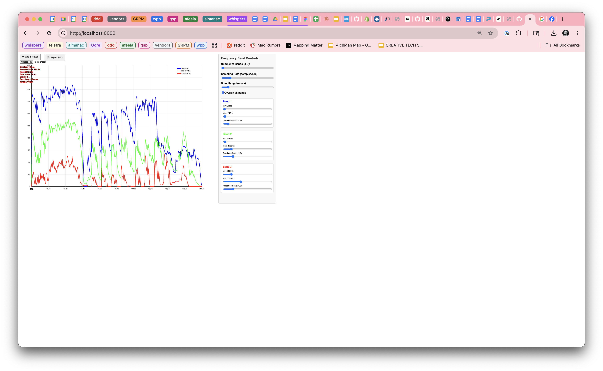

# SongPlotter

A real-time frequency visualization tool designed for pen plotting, built with p5.js and p5.sound.

## Overview

SongPlotter analyzes audio files and creates beautiful frequency visualizations optimized for pen plotting. It captures frequency data across customizable bands and generates SVG files with organized layers, perfect for plotting with tools like AxiDraw or similar pen plotters.

## Features

- **Real-time frequency analysis** with 1-8 customizable frequency bands
- **Dual visualization modes**: Linear and radial patterns
- **Flexible display options**: Overlay all bands or separate them
- **Advanced processing**: Logarithmic scaling and amplitude normalization
- **Batch processing**: Automatically process multiple audio files
- **Pen plotter optimized**: A3 landscape SVG export with organized layers
- **Volume control**: Separate sliders for analysis and playback volume
- **Clean export options**: Toggle grid and labels for minimal SVG output

## Quick Start

1. Open `index.html` in a modern web browser
2. Click "Play" to start with the default audio file, or use "File" to load your own
3. Adjust frequency bands and visualization settings in the right panel
4. Click "Export" to generate SVG files for pen plotting

## Interface

### Top Bar
- **SongPlotter** branding with "About" button for help
- **Play/Stop**: Control audio playback and frequency recording
- **Mute**: Silence audio while preserving frequency analysis
- **Export**: Generate SVG files in current visualization mode
- **Batch**: Process multiple audio files automatically
- **File inputs**: Load single files or multiple files for batch processing
- **Status bar**: Shows current playback time, recording status, and settings

### Control Panel
- **Frequency Bands**: Configure 1-8 frequency ranges with individual scaling
- **Sampling Rate**: Adjust data capture frequency (1-60 samples/second)
- **Smoothing**: Reduce noise with multi-frame averaging
- **Volume Controls**: Separate sliders for analysis and playback volume
- **Visualization Options**: 
  - Overlay vs. Separate band display
  - Linear vs. Radial visualization modes
  - Grid and label visibility toggles
  - Amplitude normalization and logarithmic scaling

## Audio Formats

Supports common web audio formats:
- MP3
- M4A/AAC
- WAV
- OGG

## SVG Export

Generated SVG files are optimized for pen plotting with:
- **A3 landscape format** (1191×842 pixels, scaled 2x for detail)
- **Organized layers**: Background, grid/axes, labels, frequency data, song title
- **Descriptive IDs**: Each frequency band has unique identifiers (e.g., `band-1-20hz-250hz`)
- **Clean styling**: CSS classes for easy customization

### Export Options

**Batch processing generates 4 variations per song:**
- Linear separate bands
- Linear overlaid bands  
- Radial separate bands
- Radial overlaid bands

## Technical Details

- **Built with**: p5.js, p5.sound, FileSaver.js
- **FFT Analysis**: 1024-point FFT with configurable smoothing
- **Frequency Range**: 20Hz - 20kHz (customizable band divisions)
- **Canvas Size**: 2382×1684 pixels (A3 landscape @ 2x scale)
- **Data Format**: Time-series frequency amplitude data

## Tips for Best Results

1. **Sampling Rate**: Higher rates (30-60 fps) capture more detail but create larger files
2. **Smoothing**: Use 3-10 frame smoothing to reduce noise without losing detail
3. **Frequency Bands**: Experiment with logarithmic spacing for musical content
4. **Clean Export**: Turn off grid and labels for minimal SVG output
5. **Batch Processing**: Use mute mode for faster processing of multiple files

## Browser Compatibility

Requires a modern browser with:
- Web Audio API support
- ES6+ JavaScript features
- SVG and Canvas support

Tested on Chrome, Firefox, Safari, and Edge.

## Files

- `index.html` - Main application page
- `sketch.js` - Core p5.js application code
- `style.css` - UI styling and responsive layout
- `libraries/` - Required JavaScript libraries
- `musicfiles/` - Sample audio files
- `jsconfig.json` - Development configuration

## Development

To modify or extend SongPlotter:

1. Edit `sketch.js` for core functionality
2. Modify `style.css` for UI styling
3. Test with different audio files
4. Use browser developer tools for debugging

The code is well-commented and organized into logical functions for easy customization.

## License

Open source - feel free to modify and distribute.